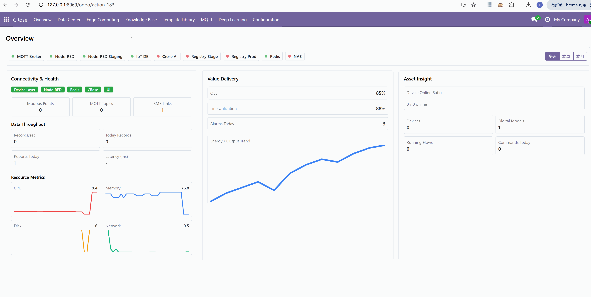
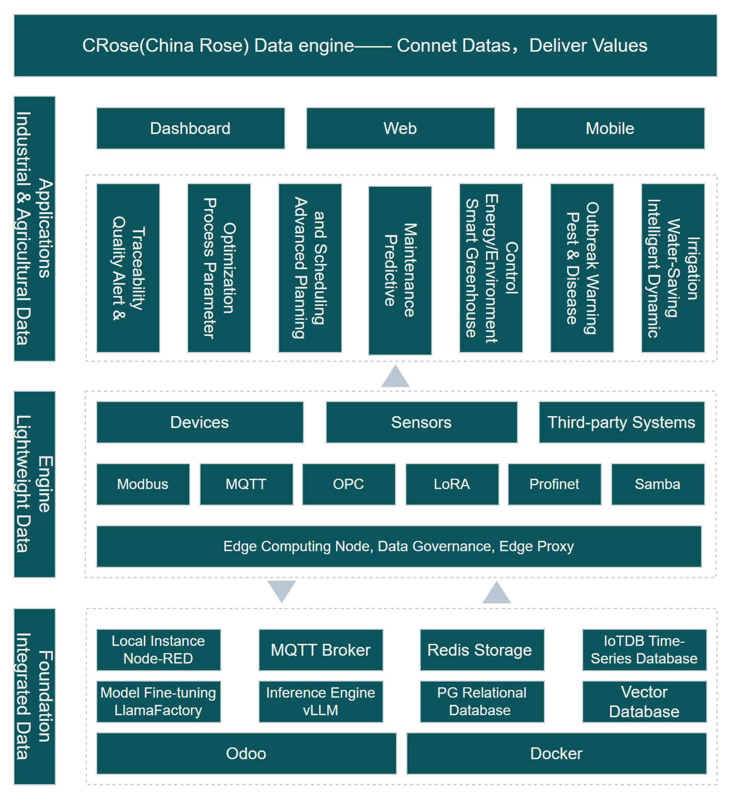

# 🌹 CRose (China Rose) - All-in-One Lightweight Data Engine

[中文版](./readme/README_CN.md)

## Connect Datas, Deliver Values

CRose is an integrated data platform designed for manufacturing and modern agriculture. It encapsulates the full stack capabilities from underlying protocol collection (Modbus/MQTT) to upper-level statistical analysis and UI visualization.



## 🌟 Why Choose CRose? Simple yet Powerful!

🚀 Out-of-the-box full‑stack platform
- A single docker-compose up launches the complete stack: Odoo, Node‑RED, IoTDB, Redis, GMqtt, etc.
- No manual selection, integration, or tuning. Industrial‑grade IoT data collection and management from day one.

📦 Scenario‑based flow template library
- Built‑in templates for 20+ common acquisition scenarios: Modbus RTU/TCP, OPC UA, MQTT, S7, …
- Covers typical equipment such as machine tools, injection molding machines, heat treatment furnaces, environmental sensors—no need to handcraft Node‑RED flows from scratch.

🧠 Natural language → auto‑generated acquisition flows
- Describe your need in everyday language (e.g., “read PLC D100 every 10s and alert if > 80”).
- The system matches templates, fills parameters, and produces executable Node‑RED flows—lowering the low‑code barrier dramatically.

📊 End‑to‑end observability of data acquisition
- Collection health board: see whether each datapoint is being collected and validation results.
- Throughput and storage statistics: total records, messages/sec, time‑series storage footprint.
- Resource monitoring: CPU/Memory/Network trends on edge nodes and servers to flag bottlenecks early.

🌐 Large‑scale edge fleet management
- Batch deployment, flow updates, version rollback, configuration drift detection.
- Designed for hundreds of Raspberry Pis/industrial PCs with fully remote ops.

✅ Native data quality governance
- Schema checks at ingestion (units, ranges, non‑null, etc.), flagging anomalies.
- Data quality reports (missing rate, latency distribution, duplication rate) to underpin trustworthy AI analytics.



## 🚀 Quick Start

> ## Note: Versions prior to 1.0 are preview versions and are not recommended for production use.

### Deployment

```
git clone https://github.com/feitasIoT/Crose.git
cd Crose
docker-compose up -d --build
```

You will find 10 containers started:
- crose-web
- crose-ai
- crose-db
- gmqtt
- iotdb
- redis
- nodered-prod
- nodered-staging
- verdaccio-prod
- verdaccio-staging

> Although many containers are started, you can complete all operations in the Crose Web interface without any concerns.

### Getting Started

- Access via browser (Chrome, Edge, etc.): http://ip:8069    Username: admin, Password: crose
- NAS(filebrowser)：访问http://ip:8081    用户名：admin，密码：FeitasCrose2026

> Initial password, please change it immediately!


## 📅 Key Milestones

### 2026.05
- Integrated model training framework to support users in training local proprietary models.

### 2026.04
- High-quality prompts and dataset calls to large models for generating Node-RED flow services.

### 2026.03
- Platform basic functionality framework.
