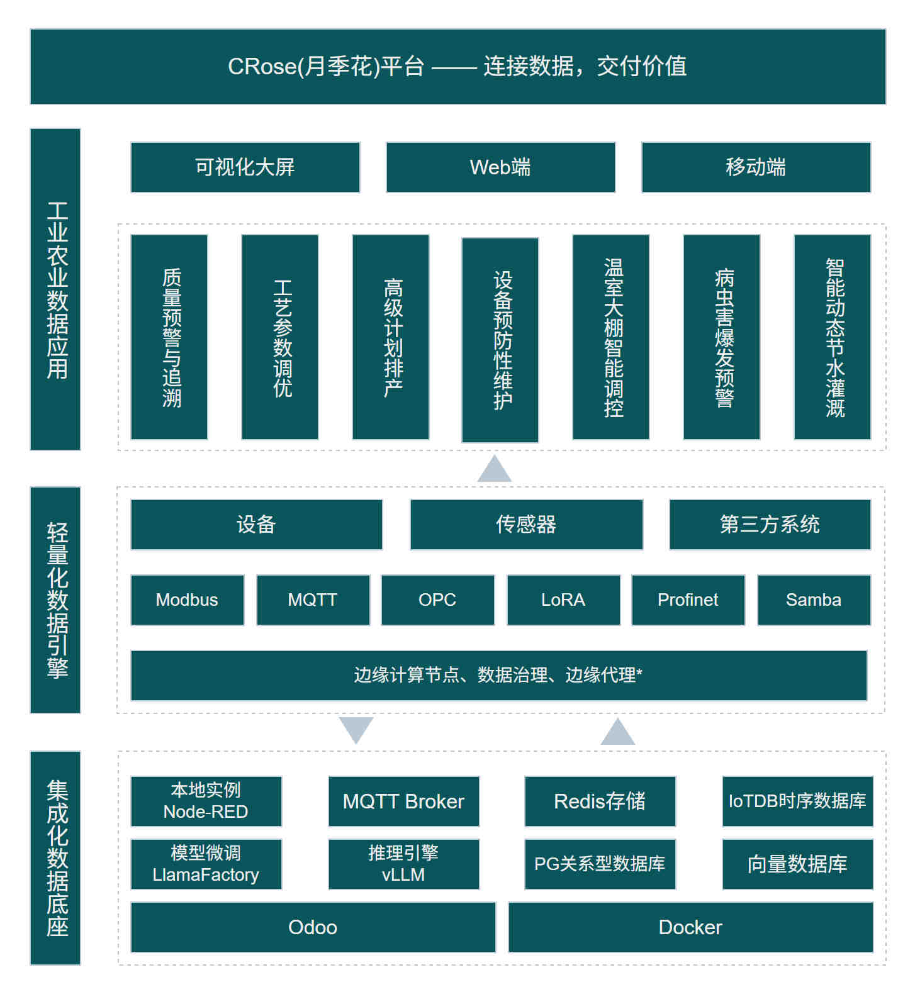

# 🌹 CRose (China Rose，月季)一站式轻量化数据引擎
## 连接数据，交付价值

CRose 是一个专为制造业与现代农业打造的集成化数据底座。它封装了从底层的协议采集（Modbus/MQTT）到上层的统计分析、UI展示的全链路能力。


## 🌟 为什么选择 CRose？简单但强大！

🚀 开箱即用的全栈平台
1. 一条 docker-compose up 命令，自动启动 Odoo + Node-RED + IoTDB + Redis + GMqtt 等全套组件
2. 无需手动选型、集成、调优，即刻拥有工业级物联网数据采集与管理能力

📦 预置场景化流程模板库
1. 内置 Modbus RTU/TCP、OPC UA、MQTT、S7 协议等 20+ 常见采集场景模板
2. 覆盖机床、注塑机、热处理炉、环境传感器等典型设备，避免从零编写 Node-RED 流程

🧠 自然语言 → 自动生成采集流程
1. 用日常语言描述需求（如 “每10秒读取PLC的D100寄存器，超出80报警”）
2. 系统自动匹配模板、替换参数、生成可执行的 Node-RED 流程，大幅降低低代码平台使用门槛

📊 数据采集全链路可观测
1. 采集健康度看板：实时显示每个数据点是否在采集、数据合法性校验结果
2. 吞吐量与存储统计：已采集记录数、每秒消息数、时序数据库占用空间
3. 资源监控：边缘节点及服务器的 CPU/内存/网络使用趋势，提前预警资源瓶颈

🌐 大规模边缘节点集中管理
1. 支持 批量部署、流程更新、版本回滚、配置漂移检测
2. 专为上百个树莓派/工控机设计，远程即可完成所有节点的运维操作

✅ 数据质量原生治理
1. 采集时自动校验数据 Schema（单位、范围、非空等），标记异常值
2. 生成数据质量报告（缺失率、延迟分布、重复率），为后续 AI 分析提供可信数据底座



## 🚀 快速开始

> ## 提示：1.0之前的版本为预览版，不建议生产使用。

### 部署

```
git clone https://github.com/feitasIoT/Crose.git
cd Crose
docker-compose up -d --build
```

你会发现启动了10个容器：
- crose-web
- crose-ai
- crose-db
- gmqtt
- iotdb
- redis
- nodered-prod
- nodered-staging
- verdaccio-prod
- verdaccio-staging
- crose-nas

> 虽然启动了不少容器，但你可以在Crose Web中完成所有操作，无需多虑。

### 体验

- 用谷歌、Edge等浏览器访问：http://ip:8069   用户名：admin， 密码：crose
- NAS(filebrowser)：访问http://ip:8081    用户名：admin，密码：FeitasCrose2026

> 初始密码，请及时修改！！

## 📅 里程碑

### 2026.05
- 集成模型训练框架，支撑用户训练本地专属模型。

### 2026.04
- 高质量提示词与数据集调用大模型生成Node-RED流程服务。

### 2026.03
- 平台基础功能框架。


